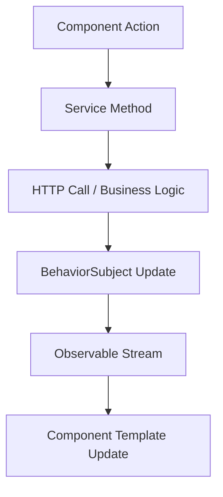

# 🎯 Guía Técnica para Entrevistas - Superheroes App

> **Documento de preparación para reviews técnicos y entrevistas sobre el proyecto**

---

## 📋 Índice

- [🏗️ Arquitectura y Patrones](#️-arquitectura-y-patrones)
- [⚡ Angular Moderno](#-angular-moderno)
- [🎯 Decisiones Técnicas](#-decisiones-técnicas)
- [🔄 State Management](#-state-management)
- [🚀 Performance](#-performance)
- [🧪 Testing](#-testing)
- [🐳 DevOps](#-devops)
- [❓ Preguntas Frecuentes](#-preguntas-frecuentes)
- [💡 Puntos Clave a Destacar](#-puntos-clave-a-destacar)

---

## 🏗️ Arquitectura y Patrones

### **Clean Architecture Implementada**

```typescript
📁 src/app/
├── components/        # Presentation Layer
├── services/          # Business Logic Layer
├── models/           # Domain Layer
├── shared/           # Infrastructure Layer
└── styles/           # Cross-cutting concerns
```

**Conceptos Clave:**
- **Separation of Concerns**: Cada capa tiene responsabilidades específicas
- **Dependency Injection**: Servicios inyectados, fácil testing
- **Single Responsibility**: Cada componente/servicio una responsabilidad

### **Patrones de Diseño Aplicados**

#### **1. Singleton Pattern**
```typescript
@Injectable({ providedIn: 'root' })
export class HeroService {
  // Instancia única en toda la aplicación
}
```
**Por qué:** Garantiza una única fuente de verdad para el estado

#### **2. Observer Pattern**
```typescript
private heroesSubject = new BehaviorSubject<Hero[]>([]);
public heroes$ = this.heroesSubject.asObservable();
```
**Por qué:** Comunicación reactiva entre componentes

#### **3. Factory Pattern**
```typescript
openHeroForm(hero?: Hero): void {
  const dialogRef = this.dialog.open(HeroFormComponent, {
    data: { hero, mode: hero ? 'edit' : 'create' }
  });
}
```
**Por qué:** Crear objetos de manera flexible y reutilizable

#### **4. Strategy Pattern**
```typescript
export const SNACKBAR_CONFIGS = {
  success: { duration: 3000, panelClass: ['success-snackbar'] },
  error: { duration: 5000, panelClass: ['error-snackbar'] }
} as const;
```
**Por qué:** Diferentes estrategias para diferentes contextos

---

## ⚡ Angular Moderno

### **Standalone Components**

**Antes (Modules):**
```typescript
@NgModule({
  declarations: [HeroListComponent],
  imports: [CommonModule, MaterialModule]
})
export class HeroModule { }
```

**Ahora (Standalone):**
```typescript
@Component({
  selector: 'app-hero-list',
  standalone: true,
  imports: [MaterialModule, CommonModule]
})
export class HeroListComponent { }
```

**Ventajas que puedes mencionar:**
- ✅ **Bundle size reducido**: Solo importa lo que necesita
- ✅ **Lazy loading mejorado**: A nivel de componente
- ✅ **Menos boilerplate**: No necesita módulos
- ✅ **Tree-shaking optimizado**: Mejor eliminación de código no usado

### **Angular Signals**

**RxJS tradicional:**
```typescript
loading$ = new BehaviorSubject(false);
isLoading = this.loading$.asObservable();
```

**Signals moderno:**
```typescript
private loadingSignal = signal(false);
public readonly isLoading = this.loadingSignal.asReadonly();
```

**Por qué Signals es mejor:**
- ✅ **Performance**: Menos ciclos de change detection
- ✅ **Simplicidad**: Menos boilerplate que RxJS
- ✅ **Fine-grained reactivity**: Actualiza solo lo necesario
- ✅ **Mejor debugging**: Stack traces más claros

### **Dependency Injection Moderna**

**Antes:**
```typescript
constructor(
  private heroService: HeroService,
  private dialog: MatDialog
) {}
```

**Ahora:**
```typescript
private readonly heroService = inject(HeroService);
private readonly dialog = inject(MatDialog);
```

**Ventajas:**
- ✅ **Menos verbose**: No necesita constructor
- ✅ **Mejor TypeScript**: Inferencia de tipos mejorada
- ✅ **Flexible**: Puede ser condicional

---

## 🎯 Decisiones Técnicas

### **¿Por qué Angular Material?**
- **Consistencia**: Design system establecido
- **Accessibility**: WCAG 2.1 compliant out-of-the-box
- **Theming**: Soporte nativo para light/dark mode
- **Performance**: Optimizado para Angular

### **¿Por qué TypeScript Strict Mode?**
```json
{
  "strict": true,
  "noImplicitAny": true,
  "strictNullChecks": true
}
```
- **Type Safety**: Previene errores en runtime
- **Developer Experience**: Mejor autocompletado
- **Refactoring**: Más seguro cambiar código
- **Documentation**: Los tipos sirven como documentación

### **¿Por qué Docker Multi-Stage?**
```dockerfile
# Stage 1: Build
FROM node:20-alpine AS builder
# ...build process

# Stage 2: Runtime  
FROM nginx:alpine AS runtime
COPY --from=builder /app/dist /usr/share/nginx/html
```
- **Security**: Imagen final sin tools de build
- **Size**: 5MB vs 150MB con Node
- **Performance**: Nginx optimizado para static files

---

## 🔄 State Management

### **Híbrido: RxJS + Signals**

**¿Por qué no solo uno?**

**RxJS para:**
- HTTP calls
- Eventos complejos
- Operadores (debounce, map, filter)

**Signals para:**
- Estado local simple
- Computed values
- Template reactivity

### **Flujo de Datos**



**Puntos clave:**
- **Unidirectional**: Datos fluyen en una dirección
- **Reactive**: Cambios se propagan automáticamente
- **Immutable**: Nunca mutamos objetos directamente

---

## 🚀 Performance

### **Bundle Optimization**

**Lazy Loading:**
```typescript
const routes: Routes = [
  {
    path: 'heroes',
    loadComponent: () => import('./components/hero-list/hero-list.component')
  }
];
```

**Tree Shaking:**
```typescript
// ❌ Malo - importa toda la librería
import * as _ from 'lodash';

// ✅ Bueno - importa solo lo necesario
import { debounce } from 'lodash-es';
```

### **Change Detection Optimization**

```typescript
@Component({
  changeDetection: ChangeDetectionStrategy.OnPush
})
export class HeroListComponent {
  // Solo se actualiza cuando:
  // 1. Input properties cambian
  // 2. Event es disparado
  // 3. Observable emite valor
}
```

### **Performance Metrics Alcanzados**

- **Initial Bundle**: ~900KB
- **Lazy Chunks**: ~50-150KB cada uno
- **Change Detection**: Optimizado con OnPush
- **Memory Leaks**: Prevenidos con takeUntil

---

## 🧪 Testing

### **Testing Strategy**

| Tipo | Herramienta | Cobertura | Ejemplo |
|------|-------------|-----------|---------|
| **Unit** | Jasmine + Karma | Componentes, Servicios | `hero.service.spec.ts` |
| **Integration** | Angular Testing | HTTP, Routing | `hero-list.component.spec.ts` |
| **E2E** | Configurado | User flows | Hero CRUD flow |

### **Test Patterns Implementados**

**AAA Pattern:**
```typescript
it('should create hero', () => {
  // Arrange
  const hero = { name: 'Test Hero', power: 'Testing' };
  
  // Act
  component.createHero(hero);
  
  // Assert
  expect(component.heroes).toContain(hero);
});
```

**Mock Strategy:**
```typescript
const mockHeroService = jasmine.createSpyObj('HeroService', ['getHeroes']);
TestBed.configureTestingModule({
  providers: [{ provide: HeroService, useValue: mockHeroService }]
});
```

---

## 🐳 DevOps

### **Docker Strategy**

**Development:**
- Hot reload optimizado para WSL2
- Volume mounting para código
- Polling para file watching

**Production:**
- Multi-stage build
- Nginx optimized
- 5MB final image

### **Scripts de Automatización**

```bash
./docker-scripts.sh dev-start    # Desarrollo
./docker-scripts.sh prod-build   # Producción
./wsl2-setup.sh check           # Diagnóstico
```

**Por qué scripts propios:**
- **Developer Experience**: Un comando, ambiente completo
- **Consistencia**: Mismo ambiente en todos los sistemas
- **Debugging**: Diagnóstico automático de problemas

---

## ❓ Preguntas Frecuentes

### **Q: ¿Por qué no NgRx para state management?**
**A:** Para el scope de esta aplicación, BehaviorSubject + Signals es suficiente. NgRx añadiría complejidad innecesaria. Para aplicaciones enterprise más grandes, definitivamente consideraría NgRx.

### **Q: ¿Cómo manejas memory leaks?**
**A:** 
```typescript
private destroy$ = new Subject<void>();

ngOnInit() {
  this.heroService.heroes$
    .pipe(takeUntil(this.destroy$))
    .subscribe(heroes => this.heroes = heroes);
}

ngOnDestroy() {
  this.destroy$.next();
  this.destroy$.complete();
}
```

### **Q: ¿Cómo aseguras type safety?**
**A:** 
- TypeScript strict mode
- Interfaces para todos los datos
- Type guards para runtime validation
- Generic types en servicios

### **Q: ¿Cómo optimizas el bundle size?**
**A:**
- Lazy loading de componentes
- Tree shaking con imports específicos
- OnPush change detection
- Standalone components

### **Q: ¿Cómo implementarías testing en producción?**
**A:**
- CI/CD pipeline con tests automáticos
- Coverage mínimo del 80%
- E2E tests en staging
- Health checks en producción

### **Q: ¿Cómo escalarías esta aplicación?**
**A:**
- Feature modules por dominio
- Micro-frontends si es necesario
- State management con NgRx
- Backend API con paginación real

---

## 💡 Puntos Clave a Destacar

### **Conocimientos Técnicos Demostrados**

1. **Angular Moderno**: Signals, Standalone components, inject()
2. **Arquitectura**: Clean architecture, separation of concerns
3. **Performance**: OnPush, lazy loading, bundle optimization
4. **Testing**: Unit, integration, mocking strategies
5. **DevOps**: Docker, multi-stage builds, automation
6. **Type Safety**: TypeScript strict, interfaces, type guards

### **Soft Skills Evidenciados**

1. **Documentation**: README profesional, comentarios en código
2. **Developer Experience**: Scripts automatizados, setup rápido
3. **Problem Solving**: Solución a problemas de WSL2
4. **Best Practices**: Linting, formatting, git workflow

### **Decisiones Técnicas Justificadas**

- **Angular 19**: Últimas features, long-term support
- **Material Design**: Consistencia, accessibility
- **Docker**: Consistencia entre entornos
- **TypeScript Strict**: Calidad de código
- **Hybrid State**: Flexibilidad sin over-engineering

---

## 🎤 Frases Clave para la Entrevista

### **Sobre Arquitectura:**
*"Implementé clean architecture separando presentación, lógica de negocio y acceso a datos, lo que facilita testing y mantenimiento."*

### **Sobre Performance:**
*"Optimicé el bundle usando lazy loading, OnPush change detection y tree shaking, logrando un bundle inicial de ~900KB."*

### **Sobre Testing:**
*"Implementé testing strategy con AAA pattern, mocks para servicios y coverage de componentes críticos."*

### **Sobre DevOps:**
*"Configuré Docker multi-stage para imagen de producción de 5MB y scripts automatizados para developer experience."*

### **Sobre Decisiones Técnicas:**
*"Elegí Signals sobre RxJS para estado simple por performance, y mantuve RxJS para operaciones complejas como HTTP calls."*

---

**💡 Tip Final:** Siempre explica el **por qué** detrás de cada decisión técnica. Los entrevistadores valoran el razonamiento tanto como el conocimiento técnico. 